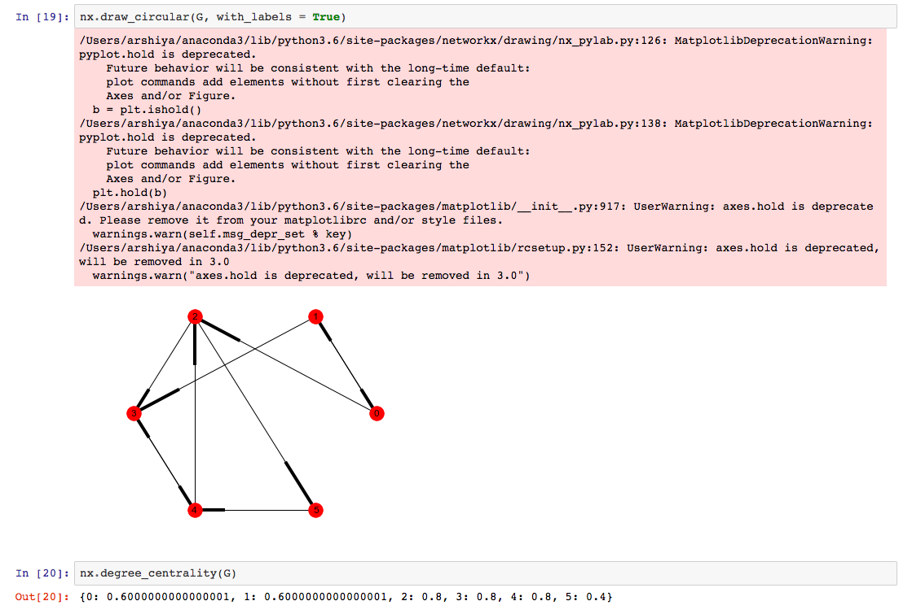
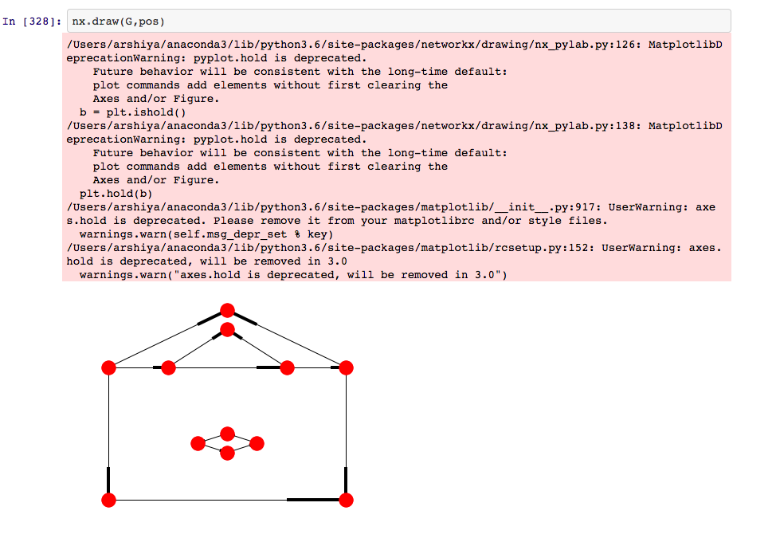

# Graphs

Directed/ Undirected graphs using technologies:

• NetworkX

Features: 

• Draw directed/undirected graphs 
• Set the positions of points on the graph 
• Use of circular/random graphs 
• Calculate degree_centrality 
• Calculate closeness_centrality 
• Calculate betweenness_centrality 
• Calculate page rank 

Steps to run the application:
1. Open the terminal
2. Enter the startup folder
3. Type "jupyter notebook" to launch and run

Below are some screenshots demonstrating the application:

### Showing the sample graphs

• Without setting the position 

• With setting the position 

